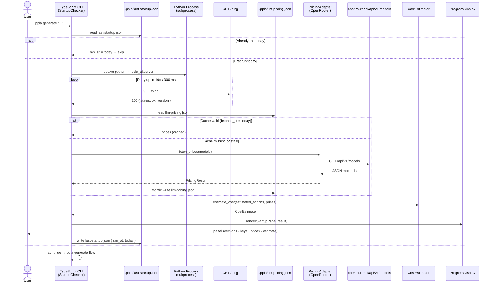

# T24 — Design: Startup Check
## Health Check, Price Scraping, and Cost Estimation

> Last updated: 2026-03-17

---

## Sequence Diagram

---

## Component Breakdown

### Python AI Service

#### `GET /ping` — Health Endpoint
- **Location**: `packages/core/python/src/server.py`
- Registered before any slow initialization so health check is always fast.
- Response: `{ "status": "ok", "version": "<semver>" }`

#### `PricingPort` — Domain Interface
- **Location**: `packages/core/python/src/domain/repository/pricing_port.py`
- Abstract base class following the existing `LlmService` port pattern.

#### `ModelPrice` — Domain Model
- **Location**: `packages/core/python/src/domain/model/model_price.py`
- Pydantic model. Fields: `model_id`, `input_usd_per_token`, `output_usd_per_token`, `context_length`, `fetched_at` (ISO date UTC).

#### `PricingAdapter` — Infrastructure (OpenRouter)
- **Location**: `packages/core/python/src/infrastructure/pricing/openrouter_pricing_adapter.py`
- Implements `PricingPort` via `httpx.AsyncClient`.
- Filters OpenRouter model list to requested `model_ids`.
- Returns empty list on any network or parse error (triggering fallback).

#### `PricingStore` — Infrastructure (Cache)
- **Location**: `packages/core/python/src/infrastructure/pricing/pricing_store.py`
- Reads/writes `.ppia/llm-pricing.json` relative to `project_root`.
- Atomic write: write to `.tmp` then rename.
- Cache schema: `{ "schema_version": 1, "models": { "<id>": ModelPrice } }`

#### `CostEstimator` — Application Use Case
- **Location**: `packages/core/python/src/application/use_cases/startup/cost_estimator.py`
- Pure function. Receives prices and `estimated_actions`, returns `CostEstimate`.
- Token budget constants in `token_budgets.py` (`AVG_TOKENS_PER_ACTION = 2_500`, `AVG_TOKENS_GENERATION = 8_000`).

---

### TypeScript CLI

#### `StartupChecker` — Orchestrator
- **Location**: `packages/core/src/cli/StartupChecker.ts`
- Coordinates: spawn Python → health poll → price fetch → cost estimate → display → write gate.

#### `PricingFetcher`
- **Location**: `packages/core/src/ai/PricingFetcher.ts`
- Node.js `fetch` to OpenRouter + daily cache R/W (atomic).

#### `CostEstimator` (TypeScript)
- **Location**: `packages/core/src/domain/CostEstimator.ts`
- Pure function mirroring the Python counterpart.

#### `LastStartupStore`
- **Location**: `packages/core/src/cli/LastStartupStore.ts`
- Reads/writes `.ppia/last-startup.json`. `hasRanToday(): boolean`.

#### `ProgressDisplay` — Extension
- **Location**: `packages/core/src/cli/ui/ProgressDisplay.ts`
- New method: `renderStartupPanel(result: StartupResult): void`.

---

## ADR-01 — Price Data Source: OpenRouter vs. llm-prices.com

**Elegido**: `openrouter.ai/api/v1/models`
**Descartado**: `llm-prices.com` (HTML scraping)
**Motivo**: OpenRouter devuelve JSON estructurado sin necesidad de parsear HTML. Cubre todos los modelos OpenAI y Anthropic relevantes. No requiere autenticación para datos de precios públicos.
**Consecuencias**: Si OpenRouter cambia el schema, el adapter falla silenciosamente (fallback a cache). Los `model_id` de OpenRouter (`openai/gpt-4o-mini`) deben mapearse a los nombres de `ppia.yaml`.

---

## ADR-02 — Caching Strategy: File-Based Daily Cache

**Elegido**: Cache en fichero con clave de fecha UTC (`.ppia/llm-pricing.json`)
**Descartado**: Sin cache (siempre fetch), in-memory, TTL de 24h
**Motivo**: Los precios cambian raramente. La cache en fichero sobrevive reinicios y funciona offline. La fecha UTC es simple y determinista.
**Consecuencias**: Primer `ppia generate` del día (UTC) hace una llamada de red (<100ms). El resto del día usa cache.

---

## ADR-03 — Display: Panel Inline Once-Per-Day vs. Comando Separado

**Elegido**: Panel inline mostrado **una vez por día** (gate FR-06)
**Descartado**: Mostrar siempre, mostrar solo en `ppia status`
**Motivo**: Mostrar siempre añade ruido. Esconder en un comando separado hace que el usuario nunca vea las estimaciones de coste. Una vez al día es el equilibrio.
**Consecuencias**: Los usuarios pueden forzar un refresh eliminando `.ppia/last-startup.json`.

---

## Consideraciones de Seguridad

| Preocupación | Mitigación |
|---|---|
| API keys en logs | `ProgressDisplay` solo muestra `✅ configured` / `❌ not set` — nunca el valor |
| API keys en HTTP bodies | Las keys se pasan via variables de entorno al subprocess Python, nunca en request bodies |
| Datos de precios | OpenRouter pricing data es pública — sin tratamiento especial |
| Permisos del fichero cache | `.ppia/llm-pricing.json` no contiene secrets — permisos estándar |
| stderr del subprocess | Capturado y mostrado solo en caso de fallo de startup |

---

## Riesgos Técnicos

| # | Riesgo | Prob. | Impacto | Mitigación |
|---|---|---|---|---|
| R1 | OpenRouter API no disponible o schema cambiado | Baja | Medio | Fallback silencioso a cache existente. Si no hay cache: "prices unavailable" y continuar. |
| R2 | Startup check > 3s (red lenta) | Media | Bajo | `fetch` con timeout de 2s. Si excede: skip y usar cache. Health check: timeout total de 3s. |
| R3 | Cache stale → estimaciones imprecisas | Baja | Bajo | Cache invalidada diariamente. Estimaciones claramente marcadas como "estimated". |
| R4 | Python process no arranca (venv ausente, Python version incorrecta) | Media | Alto | TypeScript verifica versión de Python antes de lanzar. stderr capturado y mostrado verbatim. |
| R5 | model_id OpenRouter no coincide con nombre en ppia.yaml | Media | Medio | `PricingAdapter` normaliza IDs (quita prefijo de proveedor). Fallback a "price unknown" por modelo. |
