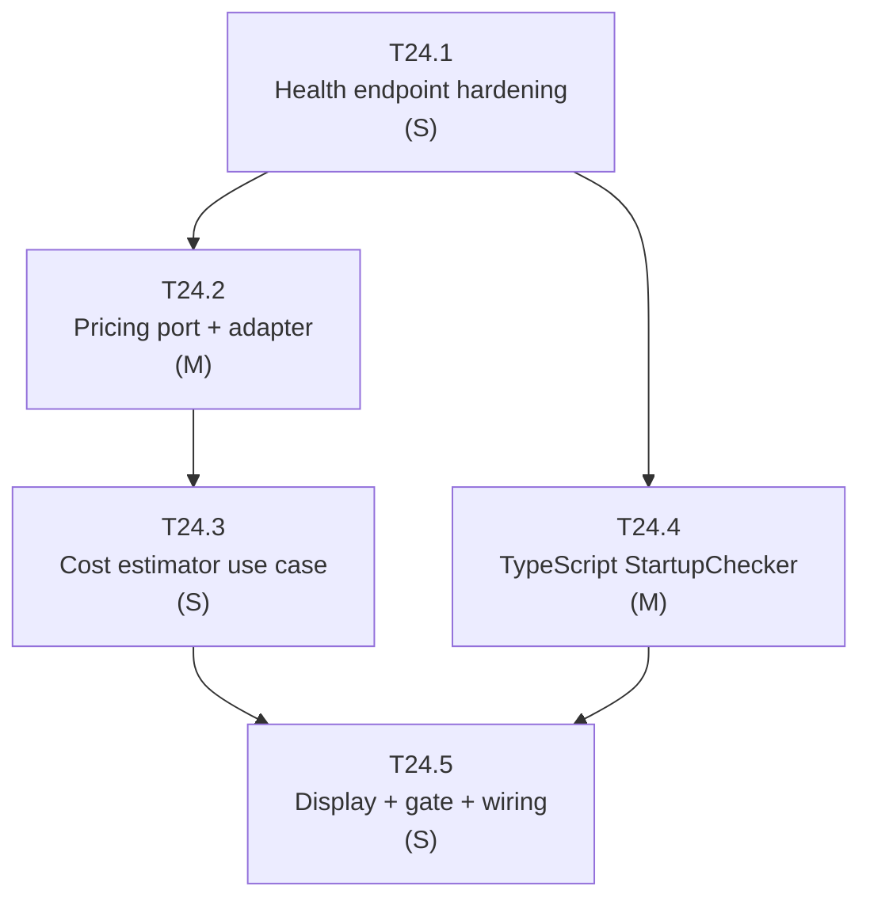

# T24 — Tasks: Startup Check
## Health Check, Price Scraping, and Cost Estimation

> Last updated: 2026-03-17

---

## Resumen de subtareas

| ID | Título | Tamaño | Depende de |
|---|---|---|---|
| T24.1 | Python health endpoint hardening + `/startup-info` | S | — |
| T24.2 | Python pricing port, domain model y OpenRouter adapter | M | T24.1 |
| T24.3 | Python cost estimator use case + token budget constants | S | T24.2 |
| T24.4 | TypeScript `StartupChecker`: spawn, health poll, price fetch, cache | M | T24.1 |
| T24.5 | TypeScript display + once-per-day gate + wiring | S | T24.3, T24.4 |

---

## T24.1 — Python health endpoint hardening + `/startup-info`

**Tamaño**: S
**Depende**: ninguna

Garantizar que `/ping` está disponible inmediatamente después del start del proceso (antes de cualquier init lento). Añadir endpoint `/startup-info` ligero.

**Ficheros afectados**:
- `packages/core/python/src/server.py` — reordenar init; añadir `GET /startup-info`
- `packages/core/python/src/application/dto/startup.py` (nuevo) — `StartupInfoResponse`
- `packages/core/python/tests/test_startup_endpoints.py` (nuevo)

**Criterios de aceptación**:
- [ ] `GET /ping` devuelve 200 en < 50 ms incluso si `ppia.yaml` loading es lento
- [ ] `GET /startup-info` devuelve `{ version, model_fast, model_strong }`
- [ ] Tests pasan con `pytest`; `mypy --strict` limpio

---

## T24.2 — Python pricing port, domain model y OpenRouter adapter

**Tamaño**: M
**Depende**: T24.1

Implementar la capa de infraestructura de precios siguiendo la arquitectura hexagonal existente.

**Ficheros afectados**:
- `packages/core/python/src/domain/repository/pricing_port.py` (nuevo) — `PricingPort` ABC
- `packages/core/python/src/domain/model/model_price.py` (nuevo) — `ModelPrice`
- `packages/core/python/src/infrastructure/pricing/openrouter_pricing_adapter.py` (nuevo)
- `packages/core/python/src/infrastructure/pricing/pricing_store.py` (nuevo) — atomic write
- `packages/core/python/src/infrastructure/config/dependency_injection.py` — registrar binding
- Tests: `test_openrouter_adapter.py`, `test_pricing_store.py` (nuevos)

**Criterios de aceptación**:
- [ ] `PricingAdapter.fetch_prices(["gpt-4o-mini", "claude-haiku-4-5"])` devuelve dos `ModelPrice` con valores no cero (test de integración, skippable offline)
- [ ] `PricingStore` atomic write: si el proceso muere a mitad de escritura, el cache existente no se corrompe
- [ ] Cache hit path no llama a HTTP (verificado con mock)
- [ ] `mypy --strict` y `ruff check` pasan

---

## T24.3 — Python cost estimator use case + token budget constants

**Tamaño**: S
**Depende**: T24.2

Implementar la lógica de estimación de coste como función pura en la capa de aplicación.

**Ficheros afectados**:
- `packages/core/python/src/application/use_cases/startup/token_budgets.py` (nuevo)
- `packages/core/python/src/application/use_cases/startup/cost_estimator.py` (nuevo)
- `packages/core/python/src/application/dto/prepare_input.py` — añadir campo `estimated_cost`
- `packages/core/python/src/application/use_cases/prepare_input/prepare_input_use_case.py` — inyectar precios y llamar a `CostEstimator`
- `packages/core/python/tests/application/startup/test_cost_estimator.py` (nuevo)

**Criterios de aceptación**:
- [ ] `estimate_cost(estimated_actions=12, ...)` devuelve `CostEstimate` con `exploration`, `generation` y `total`
- [ ] `total == exploration + generation` (tolerancia 1e-8)
- [ ] `estimated_cost` aparece en `PrepareInputResponse`
- [ ] 100% branch coverage en `cost_estimator.py`

---

## T24.4 — TypeScript `StartupChecker`: spawn, health poll, price fetch, cache

**Tamaño**: M
**Depende**: T24.1

Implementar la orquestación TypeScript del startup: spawn del proceso, retry loop de health, fetch de precios con cache diario, gate once-per-day.

**Ficheros afectados**:
- `packages/core/src/cli/StartupChecker.ts` (nuevo)
- `packages/core/src/ai/PricingFetcher.ts` (nuevo)
- `packages/core/src/domain/CostEstimator.ts` (nuevo)
- `packages/core/src/cli/LastStartupStore.ts` (nuevo)
- `packages/core/src/ai/AiServiceClient.ts` — añadir `waitForReady(timeoutMs: number)`
- `packages/core/src/cli/commands/generate.ts` — llamar `StartupChecker.run()` antes del flujo principal
- Tests: `StartupChecker.test.ts`, `PricingFetcher.test.ts` (nuevos)

**Criterios de aceptación**:
- [ ] Health retry: si Python no responde tras 10 intentos × 300 ms, lanza `StartupError` con stderr en el mensaje
- [ ] Price fetch: si `llm-pricing.json` tiene fecha de hoy, `PricingFetcher` NO llama a `fetch`
- [ ] `LastStartupStore.hasRanToday()` devuelve `true` tras `markRan()`
- [ ] Todos los tests Vitest pasan; `tsc --noEmit` limpio

---

## T24.5 — TypeScript display + once-per-day gate + wiring

**Tamaño**: S
**Depende**: T24.3, T24.4

Renderizar el panel de startup en el terminal y conectar el gate once-per-day en `ppia generate`.

**Ficheros afectados**:
- `packages/core/src/cli/ui/ProgressDisplay.ts` — añadir `renderStartupPanel(result: StartupResult)`
- `packages/core/src/cli/commands/generate.ts` — gate + display + `markRan()`
- `packages/core/tests/cli/ui/ProgressDisplay.test.ts` — snapshot test del panel
- `packages/core/tests/cli/generate.integration.test.ts` (nuevo)

**Criterios de aceptación**:
- [ ] El panel de output sigue el formato del mockup en `ARCHITECTURE.md` (sección startup)
- [ ] Los valores de API keys nunca aparecen en el output renderizado (test con key dummy)
- [ ] Cuando `hasRanToday()` es `true`, `PricingFetcher.fetchPrices()` NO se llama (verificado con mock)
- [ ] Suffix `(cached)` aparece cuando `StartupResult.pricesCached === true`

---

## Grafo de dependencias

*T24.4 puede desarrollarse en paralelo con T24.2+T24.3 (ambas parten de T24.1)*

---

## Resumen por tamaño

| Tamaño | Cantidad | Subtareas |
|---|---|---|
| S | 3 | T24.1 · T24.3 · T24.5 |
| M | 2 | T24.2 · T24.4 |

**Camino crítico**: T24.1 → T24.2 → T24.3 → T24.5

**Estimación**: T24.4 puede correr en paralelo con T24.2+T24.3 tras T24.1.
