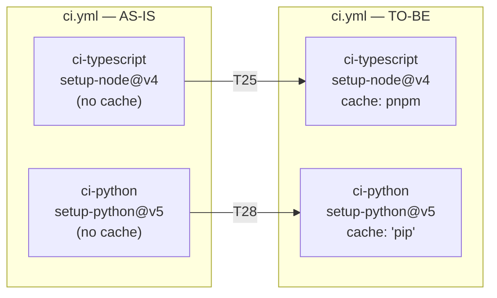
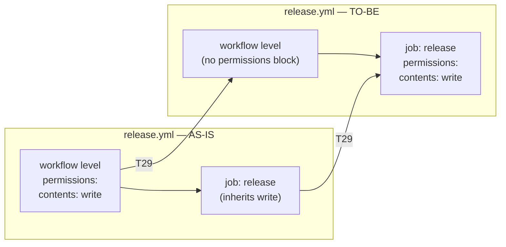

# Design — ci-cd-hardening

> Group: T25, T28, T29
> Last updated: 2026-03-17

---

## 1. AS-IS vs TO-BE

### ci.yml

### release.yml

---

## 2. Components Affected

| File | Component | Change | Task |
|------|-----------|--------|------|
| `.github/workflows/ci.yml` | `ci-typescript` job — `actions/setup-node@v4` step | Add `cache: pnpm` inside `with:` | T25 |
| `.github/workflows/ci.yml` | `ci-python` job — `actions/setup-python@v5` step | Add `cache: 'pip'` inside `with:` | T28 |
| `.github/workflows/release.yml` | Workflow-level `permissions` block | Remove from workflow scope | T29 |
| `.github/workflows/release.yml` | `release` job | Add `permissions: contents: write` at job level | T29 |

No TypeScript source files, Python source files, or test files are touched by
this group. Changes are confined entirely to GitHub Actions workflow YAML files.

---

## 3. Architectural Decision Records

### ADR-001 — Native action cache vs custom `actions/cache` step

**Status:** Accepted

**Context:**
Both `actions/setup-node@v4` and `actions/setup-python@v5` expose a built-in
`cache` parameter that internally delegates to `actions/cache`. An alternative
approach is to add an explicit `actions/cache` step before the install step,
giving full control over the cache key expression.

**Decision:**
Use the native `cache:` parameter of each setup action rather than adding a
separate `actions/cache` step.

**Rationale:**
- The native parameter uses the recommended cache key strategy for each
  ecosystem (pnpm store path derived from `pnpm-lock.yaml` hash; pip cache
  derived from dependency files).
- It reduces YAML verbosity and the number of steps per job.
- It is the officially documented approach for both actions and requires no
  additional maintenance when action versions are bumped.
- The only scenario where an explicit `actions/cache` step would be preferred
  is when a custom restore key strategy or a non-standard cache path is needed.
  Neither applies here.

**Consequences:**
- Simpler workflow YAML, easier to review.
- Cache key logic is opaque (handled internally by the action).
- If the default cache key strategy ever proves insufficient (e.g., monorepo
  with multiple lockfiles), an explicit `actions/cache` step can be introduced
  at that point without conflict.

---

### ADR-002 — Job-level permissions vs workflow-level permissions

**Status:** Accepted

**Context:**
`release.yml` currently declares `permissions: contents: write` at workflow
scope. GitHub Actions applies workflow-level permissions to all jobs in the
workflow. While the file currently contains only one job (`release`), the
pattern creates a security liability: any job added in the future would inherit
write access to repository contents by default, even if it does not require it.

**Decision:**
Move `permissions: contents: write` from the workflow level to the `release` job
level.

**Rationale:**
- Follows the GitHub-recommended principle of least privilege for Actions
  workflows: "Grant only the permissions required, at the narrowest scope."
- A job-level declaration overrides the workflow-level default for that specific
  job. With no workflow-level block, the default for all other jobs is
  `permissions: {}` (no permissions), which is the secure baseline.
- The functional behaviour of the `release` job is identical: it still receives
  `contents: write` to push the version bump commit and the git tag.
- This change future-proofs the workflow: a `publish-npm` job or a
  `post-release-notification` job added later will not accidentally inherit
  write access.

**Consequences:**
- The `release` job behaviour is unchanged.
- Future jobs in `release.yml` start with no permissions unless explicitly
  declared — this is the desired default.
- Reviewers can determine the permission scope of a job by reading only that
  job's block, without needing to check the workflow header.

---

## 4. Security Considerations

### S-01 — Poisoned cache attack surface

GitHub Actions caches are scoped to a branch and repository by default. A cache
entry created on `develop` cannot be restored on `master` unless explicitly
configured with cross-branch restore keys. The native `cache:` parameter uses
safe, branch-scoped keys, so the risk of a malicious cache entry injected from a
fork or unrelated branch is low. No additional mitigations are required for this
group.

### S-02 — Token exposure via overly broad permissions

The current `permissions: contents: write` at workflow level means the
`GITHUB_TOKEN` used in any step of any job in `release.yml` carries write access
to repository contents. If a future step calls an external action that reads the
token from the environment, that token would have broader access than intended.
Moving to job-level permissions (T29) eliminates this risk for jobs that do not
need write access.

### S-03 — No secrets introduced

No new secrets or environment variables are added by this group. Existing use of
`secrets.GITHUB_TOKEN` in `release.yml` is unchanged.

---

## 5. Risk Table

| # | Risk | Likelihood | Impact | Mitigation |
|---|------|-----------|--------|-----------|
| R-01 | pnpm cache miss on first run after T25 | High (expected) | Low — full install still runs, CI passes | Document that cold runs are expected on first execution; subsequent runs benefit from cache |
| R-02 | pip cache miss if `pyproject.toml` extras change frequently | Medium | Low — pip install still runs, no failure | The `pip` cache key includes dependency files; changes to `pyproject.toml` naturally invalidate the cache |
| R-03 | T29 breaks `git push` in release job due to missing permissions | Low — change is a structural move, not a removal | High — release pipeline stops producing tags | Validate with a manual workflow dispatch test or by reviewing the job-level permissions block before merging |
| R-04 | Future job added to `release.yml` fails silently due to default no-permissions baseline | Low — developer must read ADR-002 | Medium — unexpected permission denied error | ADR-002 documents the intent; the error message from GitHub Actions is explicit |
