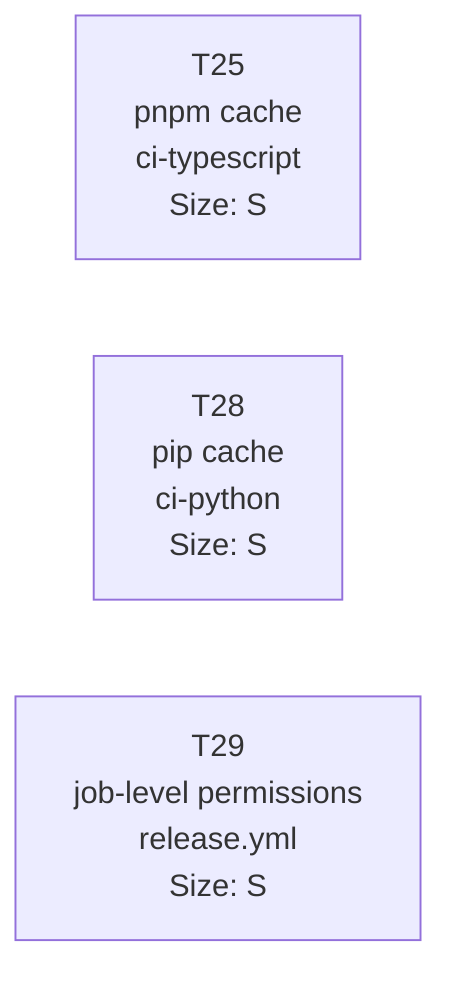

# Tasks — ci-cd-hardening

> Group: T25, T28, T29
> Last updated: 2026-03-17

---

## Task Breakdown

---

### T25 — Add pnpm cache in ci-typescript job

**Size:** S
**Branch:** `feature/t25_pnpm_cache_ci`
**File affected:** `.github/workflows/ci.yml`

**Description:**
Add `cache: pnpm` to the `actions/setup-node@v4` step inside the `ci-typescript`
job. This enables GitHub Actions' built-in pnpm store caching, keyed on
`pnpm-lock.yaml`.

**Current state (AS-IS):**
```yaml
- uses: actions/setup-node@v4
  with:
    node-version: 20
```

**Target state (TO-BE):**
```yaml
- uses: actions/setup-node@v4
  with:
    node-version: 20
    cache: pnpm
```

**Dependencies:** none

**Acceptance criteria:**
1. The `actions/setup-node@v4` step in the `ci-typescript` job contains
   `cache: pnpm` in its `with:` block.
2. A pull request CI run that does not change `pnpm-lock.yaml` restores pnpm's
   package store from cache (GitHub Actions UI shows "Cache restored" in the
   setup-node step log).

---

### T28 — Add pip cache in ci-python job

**Size:** S
**Branch:** `feature/t28_pip_cache_ci`
**File affected:** `.github/workflows/ci.yml`

**Description:**
Add `cache: 'pip'` to the `actions/setup-python@v5` step inside the `ci-python`
job. This enables GitHub Actions' built-in pip caching, keyed on dependency
files (`pyproject.toml`, `requirements*.txt`).

**Current state (AS-IS):**
```yaml
- uses: actions/setup-python@v5
  with:
    python-version: "3.11"
```

**Target state (TO-BE):**
```yaml
- uses: actions/setup-python@v5
  with:
    python-version: "3.11"
    cache: 'pip'
```

**Dependencies:** none (T25 and T28 are independent; they touch the same file
but different jobs)

**Acceptance criteria:**
1. The `actions/setup-python@v5` step in the `ci-python` job contains
   `cache: 'pip'` in its `with:` block.
2. A pull request CI run that does not change `pyproject.toml` or any
   `requirements*.txt` file restores pip's HTTP cache from the action cache
   (GitHub Actions UI shows "Cache restored" in the setup-python step log).

---

### T29 — Move permissions to job level in release.yml

**Size:** S
**Branch:** `feature/t29_job_level_permissions`
**File affected:** `.github/workflows/release.yml`

**Description:**
Remove the `permissions: contents: write` block from the workflow level in
`release.yml` and re-declare it under the `release` job. This limits write
access to repository contents to the only job that requires it, following the
principle of least privilege.

**Current state (AS-IS):**
```yaml
name: Release

on:
  push:
    branches: [master]

permissions:
  contents: write   # ← workflow level: applies to ALL jobs

jobs:
  release:
    name: Bump version & tag
    runs-on: ubuntu-latest
    steps:
      ...
```

**Target state (TO-BE):**
```yaml
name: Release

on:
  push:
    branches: [master]

jobs:
  release:
    name: Bump version & tag
    runs-on: ubuntu-latest
    permissions:
      contents: write   # ← job level: applies only to this job
    steps:
      ...
```

**Dependencies:** none

**Acceptance criteria:**
1. No `permissions` block exists at the top-level workflow scope in
   `release.yml`.
2. The `release` job block contains `permissions: contents: write`.
3. The release workflow executes successfully after the change: the "Commit and
   tag" step pushes the version bump commit and the git tag to `master` without
   a permissions error.

---

## Dependency Graph



All three tasks are **independent** — they can be implemented and merged in any
order. T25 and T28 touch different jobs within the same file; T29 touches a
different file entirely.

---

## Summary by Size

| Size | Count | Tasks |
|------|-------|-------|
| S | 3 | T25, T28, T29 |
| M | 0 | — |
| L | 0 | — |
| **Total** | **3** | |

---

## Implementation Notes

- T25 and T28 can be batched into a single PR (`feature/t25_t28_ci_cache`) if
  the team prefers to keep CI changes together. Each still maps to its own
  GitHub issue.
- T29 MUST be tested by triggering the release workflow (push to `master` or
  manual dispatch) after merging, to confirm the tag push succeeds with
  job-level permissions only.
- All three tasks have size S because each change is a one- or two-line YAML
  addition/move with no logic or test changes required.
