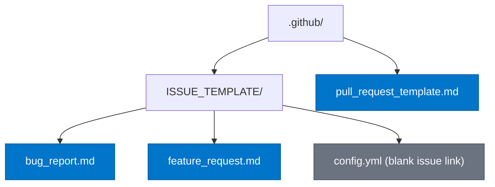

# Design — github-community
> SDD Group: T30 + T31
> Last updated: 2026-03-17

---

## File Structure



---

## Components

### bug_report.md

**Responsibility**: capture structured, reproducible bug reports from the
community with enough context to diagnose issues without back-and-forth.

**Content structure**:

| Section | Type | Notes |
|---------|------|-------|
| Description | `textarea` | Brief description of the bug |
| Steps to reproduce | `textarea` | Numbered list |
| Expected behaviour | `textarea` | What should happen |
| Actual behaviour | `textarea` | What actually happens |
| Environment | `textarea` | Node.js version, OS, `playwright-ppia` version, Playwright version |
| Error output / logs | `textarea` | Full stack trace or terminal output |
| Additional context | `textarea` | Screenshots, related issues |

**GitHub front matter**:
```yaml
name: Bug Report
description: Report a reproducible bug
labels: ["bug"]
```

**Security note**: the Environment section includes an inline reminder:
`> Do not include API keys, passwords, or any credentials.`

---

### feature_request.md

**Responsibility**: collect well-defined feature proposals that map back to
real QA automation use cases, making prioritisation decisions easier for
maintainers.

**Content structure**:

| Section | Type | Notes |
|---------|------|-------|
| Problem statement | `textarea` | What limitation are you hitting? |
| Proposed solution | `textarea` | Your preferred approach |
| Alternatives considered | `textarea` | Other options you evaluated |
| Use case context | `textarea` | Your project type, stack, workflow |
| Additional context | `textarea` | Links, prior art, mockups |

**GitHub front matter**:
```yaml
name: Feature Request
description: Propose a new feature or enhancement
labels: ["feature"]
```

---

### pull_request_template.md

**Responsibility**: enforce a consistent PR structure that links to an issue,
describes the change type, and includes a test plan — aligning with the
project's existing `Closes #N` convention and pre-push hook quality gates.

**Content structure**:

| Section | Type | Notes |
|---------|------|-------|
| Summary | bullet list | 1–3 concise bullet points |
| Type of change | checkbox list | bug fix / new feature / refactor / docs / chore |
| Test plan | checkbox list | Steps the reviewer should follow to verify |
| Issue reference | text | `Closes #N` — mandatory |

**No GitHub front matter** (PR templates do not support YAML front matter).

---

### config.yml (ISSUE_TEMPLATE)

**Responsibility**: add a "blank issue" escape hatch and optionally link to
the project's discussion forum, so contributors are not forced into a template
for open-ended questions.

```yaml
blank_issues_enabled: true
contact_links:
  - name: GitHub Discussions
    url: https://github.com/joseguillermomoreu-gif/playwright-ppia/discussions
    about: Ask questions and discuss ideas
```

---

## Architecture Decision Records

### ADR-01 — Template language: English

**Status**: Accepted

**Context**: The project's internal files (CLAUDE.md, ARCHITECTURE.md,
MEMORY.md) are in Spanish. The package is published on npm under the name
`playwright-ppia` and targets the broader Playwright / QA automation
community, which is predominantly English-speaking.

**Decision**: All `.github/` community health files are written in English.
Internal tooling files remain in Spanish.

**Consequences**:
- Community contributors can engage without a language barrier.
- Maintainer-facing files (CLAUDE.md, SDD docs) stay in Spanish as the
  working language of the team.
- No translation overhead is introduced for the public surface.

**Rejected alternative**: bilingual templates (English + Spanish inline).
Rejected because it doubles template length without proportional benefit —
the package audience is international, not primarily Spanish-speaking.

---

### ADR-02 — Issue template format: YAML front matter + Markdown body

**Status**: Accepted

**Context**: GitHub supports two formats for issue templates:
1. Legacy: plain Markdown files in `.github/ISSUE_TEMPLATE/`
2. Modern: GitHub Issue Forms (YAML-only, with `type: input/textarea/dropdown`)

**Decision**: Use the **legacy Markdown format** with YAML front matter
(`name`, `description`, `labels`).

**Rationale**:
- Issue Forms require a full YAML schema and are more brittle to maintain.
- The Markdown format renders predictably across GitHub's web UI, API,
  and third-party tools.
- The fields in bug reports and feature requests are all free-text — there
  is no benefit from dropdowns or validations at this stage.
- Easier for community contributors to preview and edit locally.

**Consequences**:
- Template fields are `<!-- comment -->` placeholders, not enforced inputs.
- If structured data extraction is needed in the future, migration to Issue
  Forms is straightforward.

**Rejected alternative**: GitHub Issue Forms (YAML).
Rejected because the added complexity and fragility is not justified for
the current contributor volume.

---

## Security Considerations

| Surface | Risk | Mitigation |
|---------|------|-----------|
| Bug report — Environment section | Contributor pastes `ppia.yaml` with credentials or API keys in plain text | Inline warning in the template body: `Do not include API keys, passwords, or credentials.` |
| Bug report — Error output section | Stack traces may contain internal paths, session IDs, or tokens | Inline note: `Redact any sensitive values before pasting.` |
| PR template — Test plan | No sensitive data expected | No specific mitigation needed |

The templates do not collect or store data themselves. All content is
submitted directly to GitHub as issue/PR bodies, governed by GitHub's
own security and privacy policies.

---

## Risk Table

| # | Risk | Probability | Impact | Mitigation |
|---|------|-------------|--------|------------|
| R1 | Contributors ignore templates and open blank issues anyway | Medium | Low | `blank_issues_enabled: true` in `config.yml` channels these; label triage handles the rest |
| R2 | Template becomes stale as the project evolves (new config fields, new CLI commands) | Medium | Medium | Templates reference the project generically, not specific CLI flags; updates needed only when the bug reproduction model changes fundamentally |
| R3 | PR template `Closes #N` placeholder is deleted by contributors | High | Low | Convention is enforced by maintainer review, not automation; the placeholder is a prompt, not a validation |
