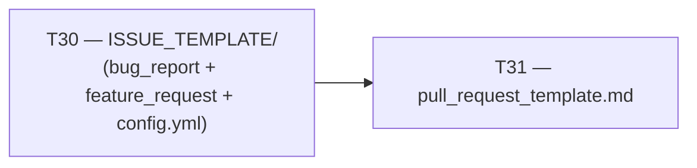

# Tasks — github-community
> SDD Group: T30 + T31
> Last updated: 2026-03-17

---

## Dependency Graph

T31 has no technical dependency on T30, but T30 is conventionally completed
first so that the PR used to deliver T31 can itself benefit from the PR
template being in place.

---

## T30 — Create .github/ISSUE_TEMPLATE/

**GitHub issue**: [#59](https://github.com/joseguillermomoreu-gif/playwright-ppia/issues/59)
**Label**: `docs`
**Size**: XS
**Branch**: `feature/t30_github_issue_templates`
**Base**: `origin/develop`

### Description

Create the `.github/ISSUE_TEMPLATE/` directory with three files:
- `bug_report.md` — structured bug report template
- `feature_request.md` — feature proposal template
- `config.yml` — blank issue opt-in and Discussions link

### Files affected

| File | Action |
|------|--------|
| `.github/ISSUE_TEMPLATE/bug_report.md` | Create |
| `.github/ISSUE_TEMPLATE/feature_request.md` | Create |
| `.github/ISSUE_TEMPLATE/config.yml` | Create |

### Acceptance criteria

1. When a contributor clicks "New Issue" on the repository, GitHub presents
   two template options — "Bug Report" and "Feature Request" — plus a
   "blank issue" option.
2. Each template pre-fills the issue body with the sections defined in
   `design.md` (Description, Steps to Reproduce, Environment, etc.),
   and automatically applies the corresponding label (`bug` or `feature`).
3. The bug report template contains a visible security reminder to redact
   credentials before submitting.
4. `config.yml` enables blank issues and includes a link to GitHub
   Discussions.

### Implementation notes

- YAML front matter uses only `name`, `description`, `labels` — no Issue
  Forms schema (see ADR-02).
- All content in English (see ADR-01).
- Template sections use HTML comment placeholders (`<!-- ... -->`), not
  hard-coded example text that contributors would have to delete.

---

## T31 — Create .github/pull_request_template.md

**GitHub issue**: [#60](https://github.com/joseguillermomoreu-gif/playwright-ppia/issues/60)
**Label**: `docs`
**Size**: XS
**Branch**: `feature/t31_github_pr_template`
**Base**: `origin/develop`
**Depends on**: T30 (by convention — T30 should be merged first)

### Description

Create `.github/pull_request_template.md`, which GitHub auto-fills into the
PR body for every new pull request opened against the repository.

### Files affected

| File | Action |
|------|--------|
| `.github/pull_request_template.md` | Create |

### Acceptance criteria

1. When a contributor opens a new PR, GitHub pre-fills the body with the
   template sections: Summary, Type of Change (checkbox list), Test Plan
   (checkbox list), and an issue reference line with `Closes #N`.
2. The template does not include a YAML front matter block (PR templates
   do not support it; adding one would render it as raw text in the PR body).
3. The `Closes #N` line is present and matches the automatic issue-closing
   convention documented in `CLAUDE.md`.

### Implementation notes

- File location must be exactly `.github/pull_request_template.md`
  (case-sensitive; GitHub does not recognise alternative paths).
- All content in English (see ADR-01).
- Checkboxes use `- [ ]` syntax so they render as interactive checkboxes
  in GitHub's PR UI.

---

## Summary by size

| Size | Count | Tasks |
|------|-------|-------|
| XS | 2 | T30, T31 |
| S | 0 | — |
| M | 0 | — |
| L | 0 | — |

Both tasks are **XS** — they involve only Markdown file creation with no
code changes, no test suite changes, and no CI/CD impact.
Total estimated effort: < 1 hour combined.
