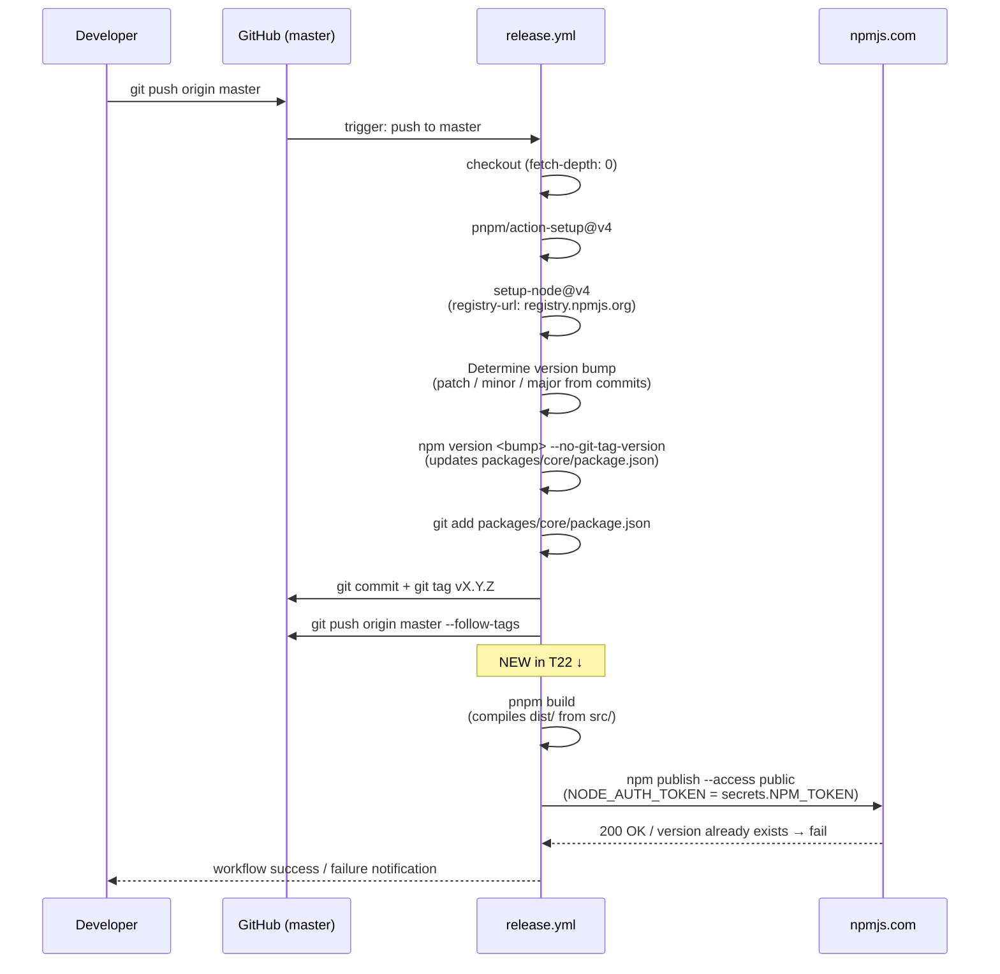

# Design — Release Readiness (T21 / T22 / T23)

> Group: `release-readiness`
> Tasks: T21 (Documentation), T22 (npm publish), T23 (Example project)

---

## 1. Release Pipeline — Sequence Diagram



---

## 2. Components

### 2.1 `packages/core/README.md` (NEW — T21)

**Purpose**: Public-facing documentation shown on the npm package page and in the GitHub directory.

**Structure**:
```
packages/core/README.md
├── Header: name + badge (npm version, license)
├── Short description
├── Prerequisites (Node >=18, Python >=3.10, API key)
├── Installation
├── Quick Start (ppia init → ppia generate)
├── CLI Reference (all subcommands: generate, run, setup, suite, docs, compare)
├── Configuration (ppia.yaml overview)
├── How It Works (TypeScript + Python AI Service architecture note)
└── Contributing (link to root CONTRIBUTING.md)
```

**Language**: English (see ADR-03).

**Relationship to existing docs**: The root `README.md` already exists and covers the project broadly. `packages/core/README.md` is package-scoped and npm-oriented. They do not duplicate; the root README links to the package README for API/CLI details.

---

### 2.2 `CONTRIBUTING.md` (NEW — T21)

**Purpose**: Onboarding guide for contributors; referenced from `packages/core/README.md`.

**Location**: Repository root (`/CONTRIBUTING.md`).

**Structure**:
```
CONTRIBUTING.md
├── Prerequisites (Node 20+, pnpm 9+, Python 3.10+)
├── Local setup
│   ├── pnpm install (from root)
│   ├── Python venv + pip install -e ".[dev]"
│   └── Environment variables (.env.example reference)
├── Repository layout
│   ├── packages/core/src/ — TypeScript
│   ├── packages/core/python/ — Python AI Service
│   └── examples/ — usage examples
├── Quality checks
│   ├── TypeScript: pnpm lint / pnpm typecheck / pnpm test
│   └── Python: ruff check / mypy --strict / pytest
├── Branch & commit conventions (Conventional Commits)
├── PR workflow (feature/tN_desc → develop → master)
└── Release process (automated via release.yml)
```

---

### 2.3 `.github/workflows/release.yml` (MODIFIED — T22)

**Current state**: The final step is a placeholder `echo` with no actual publish.

**Changes required**:

1. Add `registry-url` to the existing `setup-node@v4` step:
   ```yaml
   - uses: actions/setup-node@v4
     with:
       node-version: 20
       cache: pnpm
       registry-url: https://registry.npmjs.org
   ```

2. Replace the placeholder step with two real steps:
   ```yaml
   - name: Build
     working-directory: packages/core
     run: pnpm build

   - name: Publish to npm
     working-directory: packages/core
     run: npm publish --access public
     env:
       NODE_AUTH_TOKEN: ${{ secrets.NPM_TOKEN }}
   ```

3. No other steps change. The version bump, commit, and tag steps remain identical.

**Secret required**: `NPM_TOKEN` must be added to the repository's GitHub Actions secrets by a repository administrator before merging T22.

---

### 2.4 `examples/basic-project/` (NEW — T23)

**Purpose**: A minimal, copy-paste-ready project showing the full `ppia init` → `ppia generate` workflow.

**Directory structure**:
```
examples/basic-project/
├── package.json          # devDependency: playwright-ppia ^0.x.x
├── ppia.yaml             # pre-filled example config (no real API key)
├── README.md             # step-by-step walkthrough
└── .gitignore            # ignores .ppia/, output/, node_modules/
```

**`package.json` content**:
```json
{
  "name": "ppia-basic-example",
  "version": "1.0.0",
  "private": true,
  "scripts": {
    "ppia": "ppia"
  },
  "devDependencies": {
    "playwright-ppia": "^0.1.0"
  }
}
```

**`ppia.yaml` content** (illustrative — no real credentials):
```yaml
users:
  - name: demo
    model: openai/gpt-4o-mini
    api_key: "YOUR_OPENAI_API_KEY"
base_url: "https://example.com"
output_dir: output/
```

**`README.md` walkthrough**:
1. `npm install` — installs `playwright-ppia`
2. Edit `ppia.yaml` — add real API key and base URL
3. `npx ppia generate "Login with valid credentials"`
4. Inspect `output/` for the generated spec

---

## 3. Architectural Decision Records

### ADR-01 — npm publish scope: public unscoped package

**Status**: Accepted

**Context**: The package name `playwright-ppia` is currently unscoped. We could publish as `@ppia/core` (scoped) or keep it unscoped.

**Decision**: Keep `playwright-ppia` as an unscoped public package.

**Consequences**:
- `npm publish --access public` is needed only once for a new unscoped package; subsequent publishes default to public.
- No npm organization setup required.
- The name `playwright-ppia` is descriptive and searchable (`playwright` prefix aids discoverability).
- Scoped packages (`@ppia/*`) would require an npm organization named `ppia` and would complicate the install UX (`npm install --save-dev @ppia/core` vs `npm install --save-dev playwright-ppia`).

**Rejected alternative**: `@playwright-ppia/core` — overly verbose and provides no benefit at this stage.

---

### ADR-02 — Example project structure: static files, no live app dependency

**Status**: Accepted

**Context**: An example project could be (a) runnable against a live URL, (b) runnable against a local mock server, or (c) purely illustrative static files with no runtime dependency.

**Decision**: The example at `examples/basic-project/` is static documentation with no runtime dependency. It shows realistic file contents and a step-by-step README, but does not ship a mock server or require any running application.

**Consequences**:
- Zero CI complexity: no need to spin up a test server in GitHub Actions to validate the example.
- Users understand the workflow from reading rather than running.
- Downside: the example cannot be automatically tested end-to-end. This is accepted because a runnable E2E example belongs to a future "demo project" task, not the release-readiness group.

**Rejected alternative**: Mock server (e.g., `json-server`) embedded in `examples/basic-project/` — deferred to a future task.

---

### ADR-03 — Documentation language: English only

**Status**: Accepted

**Context**: The internal codebase comments, commit messages, and existing `docs/ARCHITECTURE.md` are in Spanish. The npm package will be published publicly and consumed internationally.

**Decision**: All public-facing documentation (`packages/core/README.md`, `CONTRIBUTING.md`, `examples/basic-project/README.md`) SHALL be written in English. Internal documents (`docs/ARCHITECTURE.md`, issue bodies, PR descriptions) may remain in Spanish.

**Consequences**:
- npm page and GitHub README are accessible to the global community.
- No translation maintenance burden: internal and external docs are clearly separated by language.
- No existing internal docs need to be rewritten.

---

## 4. Security Considerations

| Concern | Mitigation |
|---|---|
| `NPM_TOKEN` exposure in logs | Used only as `NODE_AUTH_TOKEN` env var on the publish step; no `echo`, no `--verbose` npm flag |
| `NPM_TOKEN` committed to repo | Never written to `.npmrc` or any committed file; stored exclusively as a GitHub Actions secret |
| Accidental publish of source files | `files` field in `package.json` is already set to `["dist/", "python/"]`; validated before enabling real publish |
| `.env` files bundled in npm artifact | `.env*` is not in `dist/` or `python/`; no additional `.npmignore` needed given the `files` whitelist |
| Token scope | The `NPM_TOKEN` used should be an Automation token (not a Classic token) scoped to publish only for `playwright-ppia` |
| Re-runs publishing duplicate versions | `npm publish` fails with `E403` if version already exists; the step will surface this error and not silently overwrite |

---

## 5. Risk Table

| # | Risk | Likelihood | Impact | Mitigation |
|---|---|---|---|---|
| R-01 | `NPM_TOKEN` secret not provisioned before T22 merge | Medium | High — publish step fails on first real release | Document secret setup requirement in T22 PR description; block merge until administrator confirms secret is set |
| R-02 | `dist/` not generated before publish (missing `pnpm build` step) | Low | High — npm artifact contains no compiled code | Explicit `pnpm build` step added immediately before `npm publish` in release.yml |
| R-03 | Package name `playwright-ppia` already claimed on npm | Low | High — publish fails with 403 | Verify name availability on npmjs.com before merging T22 (name was available at time of writing) |
| R-04 | `python/` directory exceeds npm artifact size limits or surprises users | Low | Medium — large install size, confusing for JS-only users | Document in `packages/core/README.md` that Python files are bundled and why; consider size badge |
| R-05 | Example project's `ppia.yaml` misleads users into using wrong model names | Low | Low — config error at runtime, not security risk | Add inline comments in `ppia.yaml` example explaining each field; link to docs |
