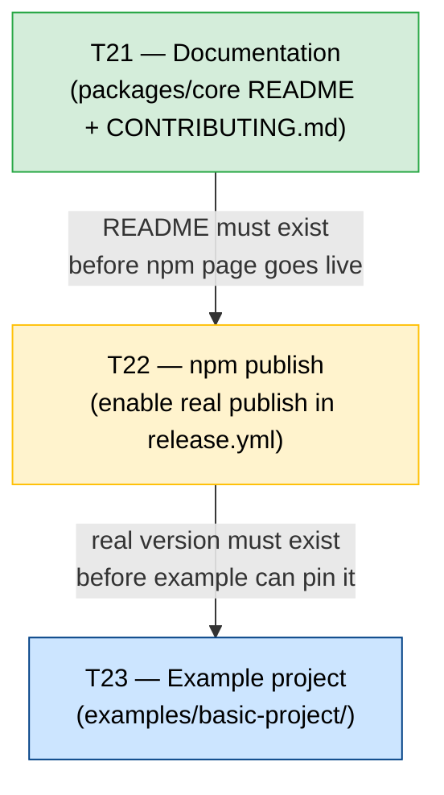

# Tasks — Release Readiness (T21 / T22 / T23)

> Group: `release-readiness`
> All tasks: size M

---

## T21 — Documentation for contributors + public README

**GitHub Issue title**: `[T21] Add packages/core README and root CONTRIBUTING.md`
**Label**: `docs`
**Size**: M
**Depends on**: — (no dependencies)
**Blocks**: T22 (README must exist before the npm page goes live)

### What

Create two new documentation files:
1. `packages/core/README.md` — public, English, shown on the npm package page
2. `CONTRIBUTING.md` (repository root) — contributor onboarding guide

### Acceptance Criteria

- [ ] `packages/core/README.md` exists and covers: description, prerequisites, installation, quick start (`ppia init` + `ppia generate`), all CLI subcommands, `ppia.yaml` overview, link to `CONTRIBUTING.md`
- [ ] `CONTRIBUTING.md` exists at repo root and covers: prerequisites, local setup (TypeScript + Python), quality check commands, branch/commit conventions, PR workflow
- [ ] Both files are written in English
- [ ] No content is duplicated between `packages/core/README.md` and the root `README.md`
- [ ] `packages/core/README.md` is referenced/linked from the root `README.md`

### Files affected

```
packages/core/README.md         (NEW)
CONTRIBUTING.md                 (NEW)
README.md                       (MODIFIED — add link to packages/core/README.md)
```

### Estimated effort

~2–3h (writing + review)

---

## T22 — Enable real npm publish in release.yml

**GitHub Issue title**: `[T22] Enable npm publish in release pipeline`
**Label**: `chore`
**Size**: M
**Depends on**: T21 (README must exist before first publish)
**Blocks**: T23 (example project pins a real published version)

### What

Replace the placeholder `echo` step in `.github/workflows/release.yml` with a real `npm publish --access public` step authenticated via `NPM_TOKEN`.

### Acceptance Criteria

- [ ] `setup-node@v4` step in `release.yml` has `registry-url: https://registry.npmjs.org`
- [ ] A `pnpm build` step runs before `npm publish`
- [ ] `npm publish --access public` runs with `NODE_AUTH_TOKEN: ${{ secrets.NPM_TOKEN }}`
- [ ] The placeholder `echo` step is removed
- [ ] `NPM_TOKEN` secret is provisioned in GitHub Actions secrets by a repository administrator (verified before merge)
- [ ] `packages/core/package.json` `files` field is validated: only `dist/` and `python/` are included
- [ ] First real publish after merge produces a visible version on npmjs.com
- [ ] `NODE_AUTH_TOKEN` is not printed in any log line

### Pre-merge checklist (manual)

- [ ] Verify `playwright-ppia` name is available on npmjs.com (or already owned by the project)
- [ ] Confirm `NPM_TOKEN` secret is set in repository Settings → Secrets → Actions
- [ ] Run `pnpm build` locally and confirm `dist/` is populated correctly
- [ ] Run `npm pack --dry-run` from `packages/core/` and review the file list

### Files affected

```
.github/workflows/release.yml   (MODIFIED — replace placeholder step)
```

### Estimated effort

~1–2h (implementation + manual verification)

---

## T23 — Example project (examples/basic-project/)

**GitHub Issue title**: `[T23] Add basic example project showing ppia init and generate`
**Label**: `docs`
**Size**: M
**Depends on**: T22 (example pins a real npm version; should not reference an unpublished package)

### What

Create a self-contained example under `examples/basic-project/` that documents the full onboarding flow from zero to first generated test.

### Acceptance Criteria

- [ ] `examples/basic-project/package.json` exists with `playwright-ppia` as a dev dependency (version matching the latest published release)
- [ ] `examples/basic-project/ppia.yaml` exists with realistic but clearly non-functional placeholder values (e.g., `api_key: "YOUR_OPENAI_API_KEY"`)
- [ ] `examples/basic-project/README.md` exists and walks through: install → edit ppia.yaml → `ppia generate` → inspect output
- [ ] `examples/basic-project/.gitignore` ignores `node_modules/`, `.ppia/`, `output/`
- [ ] The example requires no running application or external server to be read and understood
- [ ] Root `README.md` links to `examples/basic-project/` as the quickstart reference

### Files affected

```
examples/basic-project/package.json     (NEW)
examples/basic-project/ppia.yaml        (NEW)
examples/basic-project/README.md        (NEW)
examples/basic-project/.gitignore       (NEW)
README.md                               (MODIFIED — add link to example)
```

### Estimated effort

~2–3h (writing + review)

---

## Dependency Graph



---

## Summary by size

| Size | Count | Tasks |
|------|-------|-------|
| M | 3 | T21, T22, T23 |
| **Total** | **3** | |

### Recommended implementation order

1. **T21** — Write documentation first so the npm page is not blank on first publish
2. **T22** — Enable real publish once README is merged; provision `NPM_TOKEN` secret before merging
3. **T23** — Create example project after first version is live on npm so the pinned version is real

### Critical path

```
T21 (2–3h) → T22 (1–2h) → T23 (2–3h)
Total: ~5–8h sequential
```

All three tasks are sequential (no parallelisation possible due to dependencies). Total elapsed time is bounded by the critical path.
